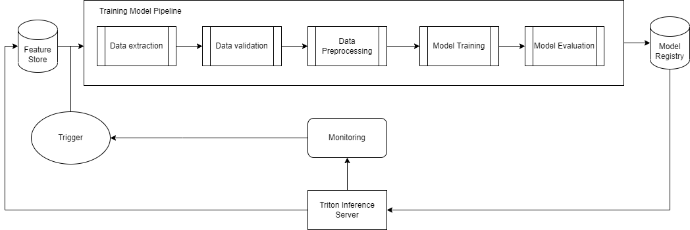

# MLOps Pigs Activity Recognition

## ClearML
1) [Upload dataset](clearml/upload_dataset_task.py)
2) [Validate data](clearml/data_validation_task.py): all images have label file
3) [Preprocess dataset](clearml/data_preprocessing_task.py): apply paddock maks to image
4) [Train model](clearml/training_task.py): train yolov5 model
5) [Training pipeline](clearml/pipeline.py): build training pipeline from 2-4 tasks
6) [Scheduler](clearml/train_scheduler.py): create training scheduler from pipeline

## Triton Inference Server
* [yolov5s_onnx config](triton/triton_server/models/yolov5s_onnx/config.pbtxt)
* [Prometheus + Grafana monitoring service](triton/prometheus-grafana/docker-compose.yml)
* [Yolo-Triton prediction service](triton/yolo_triton_service.py)
